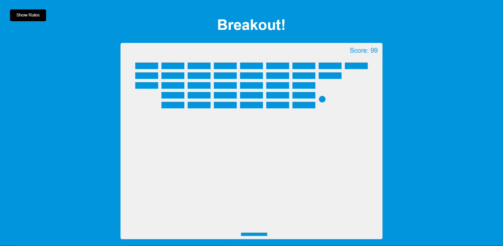

# breakout_game

## Description

This is the classic game breakout recreated using HTML, CSS, and JavaScript. The aim of the game is to bounce the ball with the paddle to hit all the blocks and get a high score. If the player breaks all the blocks the blocks will reset and the players score will continue to increase as long as the ball keeps hitting the new bricks. If the ball touches the bottom of the screen the player game ends, and the player score along with all the bricks reset.
This game was created using the HTML canvas element and the associated api. There is a button on the left side of the screen that the player can click and this will show the rules of the game. The rules can then be hidden again by clicking on the close rules button.

## Demo

A demo for the project can be found at: https://tod619.github.io/breakout_game/
